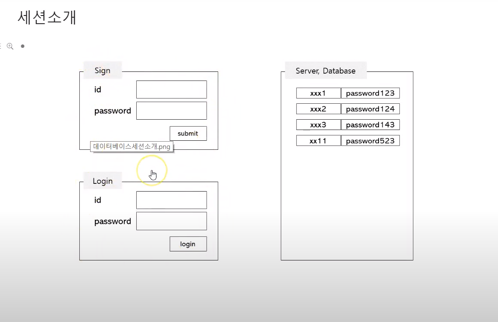

## 코틀린 스프링 부트 #6
- ref : https://www.youtube.com/playlist?list=PL4bPfpQGrkz7Y_7D5X2UaWGYTTdaCNoDs
---

### 웹 브라우저에서 "hello world" 출력해보기
- udemy 스프링부트 프로젝트 run
- 스프링 부트와 http 동작이해
- Controller 생성, method와 url매핑
- 템플릿 엔진 mustache 사용
- 웹브라우저에서 hello world확인
- 고급 url 매핑

### Kotlin microservices with spring boot
- 개발 전 준비
- 로그인 기능 구현
- 데이터 베이스 구현

### 데이터베이스 구현
- 세션소개
- 데이터베이스 구현

### 세션 소개
 
  
- sign화면에 id pwd 등록
- 해당하는 서버에 데이터베이스로 등록
- 로그인 시 아이디 패스워드 입력하면 데이터베이스에 있는 패스워드와 일치하는지 확인하여 로그인을 활성화 시켜줌
