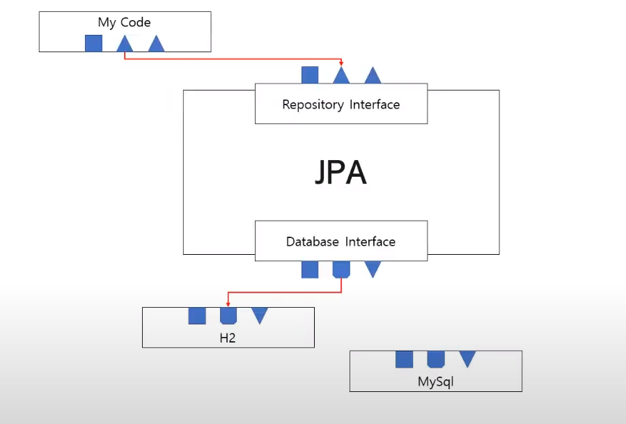

## 코틀린 스프링 부트 #6
- ref : https://www.youtube.com/playlist?list=PL4bPfpQGrkz7Y_7D5X2UaWGYTTdaCNoDs
---

### 데이터베이스 구현
- 세션소개
- JPA 설명

### JPA 설명
- 추상화 된 ORM(Object-Relational Mapping)
- 과거 데이터베이스 연결은 SQL 문으로
- 더이상 SQL문은 쓰지 않는다
  - 프로그램 라이브러리를 쓰는 것처럼 DB를 컨트롤하고 싶었던 것.
- 데이터베이스가 바꿔도 코드는 그대로
  -  
  -  상단 MY CODE는 우리가 짜야하는 코드고 아래에 갈수록 MYSQL코드이다.
  -  상단 MY CODE가 Repository Interface를 이용하여 코딩이 완료가 된다면 db와 인터페이스가 가능해진다
  -  초기에는 h2 임베디드 db를 이용하여 sql을 수행한다.
  -  location 구동시 부족한점이 있기 때문에 mysql을 바꿔서 사용을 한다.(스프링 부트의 db 설정만 바꿔서 사용하면됨)

 