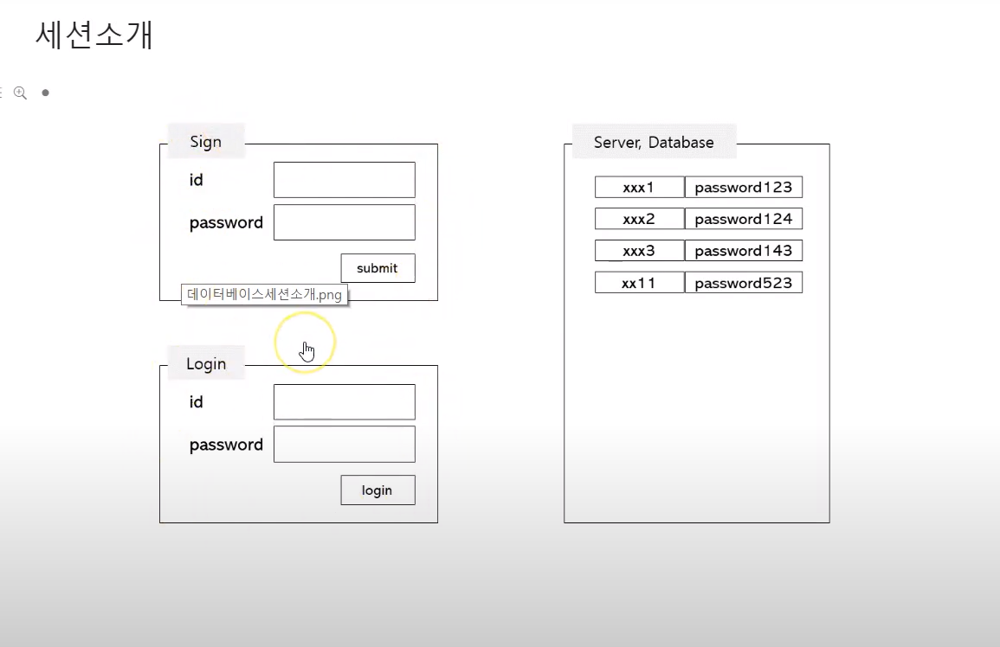
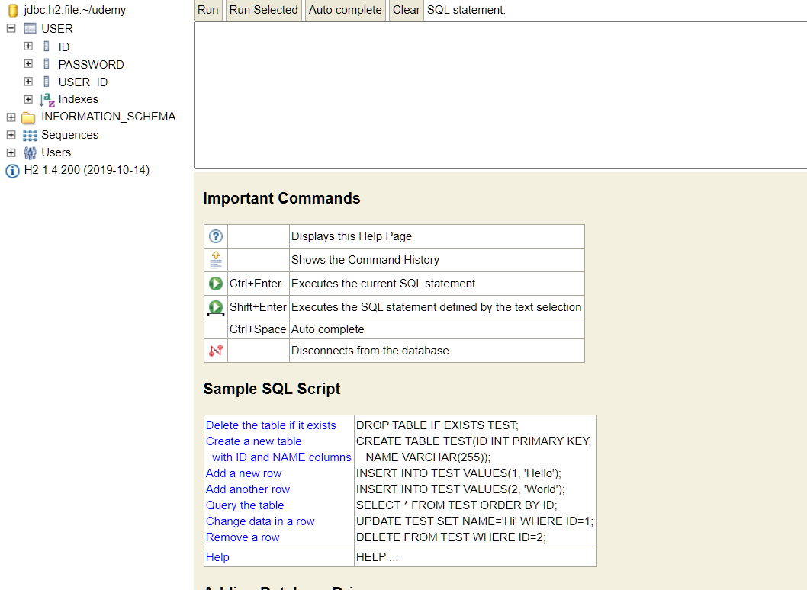

## 코틀린 스프링 부트 #6
- ref : https://www.youtube.com/playlist?list=PL4bPfpQGrkz7Y_7D5X2UaWGYTTdaCNoDs
---

### 데이터베이스 구현
- 세션소개
- JPA 설명
- 사용할 db 환경설정
  - 다음을 추가한다.
    ```
    //application.properties
    #database
    spring.datasource.name=udemy
    spring.datasource.initialize=false
    spring.datasource.driverClassName=org.h2.Driver

    spring.datasource.url=jdbc:h2:file:~/udemy
    #database의 엔티티 설정을 한 후 실행을 해야한다.
    ```
- @Entity, User 타입 정의
- Repository 인터페이스
- Repository @Autowire
- repository.save 로 User저장

---
### 세션 소개
 
  
- sign화면에 id pwd 등록
- 해당하는 서버에 데이터베이스로 등록
- 로그인 시 아이디 패스워드 입력하면 데이터베이스에 있는 패스워드와 일치하는지 확인하여 로그인을 활성화 시켜줌

- 예제코드(엔티티 선언)
    ```
    @Entity // 해당 클래스는 테이블에 해당한다.
    class User (
        var userId:String,
        var password:String,
        @Id @GeneratedValue var id:Long?=null
    )

    // 대충 테이블 선언이라고 생각하면 된다는 것.

    //CREATE TABLE USER(
    //  userId TEXT NOT NULL,
    //  password VARCHAR(20) NOT NULL,
    //  id LONG NOT NULL PRIME KEY
    // )
    //@GeneratedValue 자동적으로생성
    //@Id primary key
    ```
- http://localhost:8080/h2-console/ 로 h2 접속
- 아이디 비번 없음

