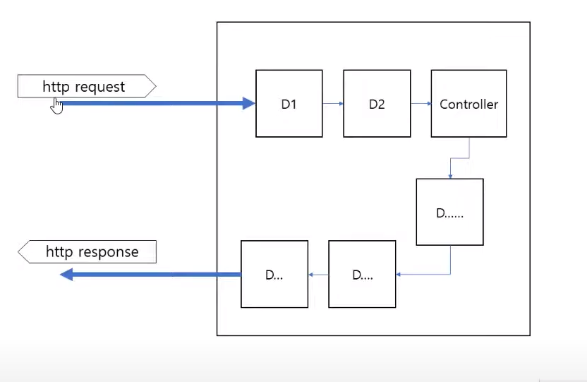
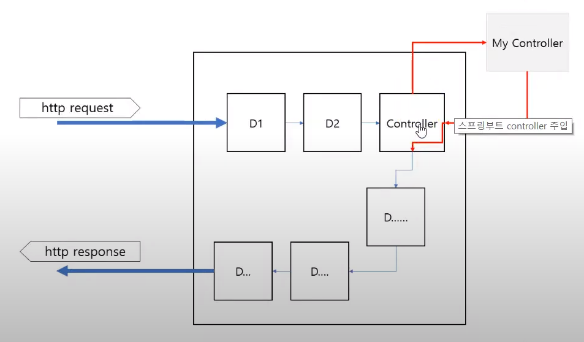

## 코틀린 스프링 부트 #5
- ref : https://www.youtube.com/playlist?list=PL4bPfpQGrkz7Y_7D5X2UaWGYTTdaCNoDs
---

### 로그인 기능 구현
- 색션 소개
- 스프링 부트 프로젝트 생성
- 웹 브라우저에 "hello world"출력
- 스프링 부트와 Mvc 패턴 이해

### 웹 브라우저에서 "hello world" 출력해보기
- udemy 스프링부트 프로젝트 run
- 스프링 부트와 http 동작이해
- Controller 생성, method와 url매핑
- 템플릿 엔진 mustache 사용
- 웹브라우저에서 hello world확인
- 고급 url 매핑

### 스프링 부트와 http 동작 이해
- http 통신과 스프링 부트 동작 개념

- http 1

- http 2

---

### Controller 생성, method와 url매핑
- HtmlController.kt, Controller클래스 생성
- @Controller 어노테이션 부여
- 클래스 안에 <"h1>hello world</h1"> 출력할 수 있는 method코딩
- method에 @RequestMapping (...) 어노테이션 부여

### 템플릿 엔진이란?
- mustache : template engine
- {{}} 안에 데이터 값을 전달하는 걸로 사용
